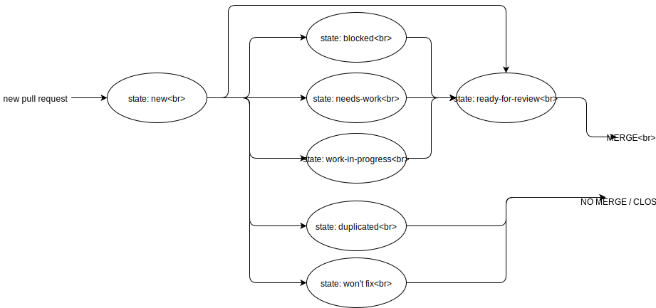

= Contributing to Urlaubsverwaltung

The Urlaubsverwaltung is released under the Apache 2.0 license. If you would like to contribute
something, or simply want to hack on the code this document should help you get started.

== Using GitHub Issues
We use GitHub issues to track bugs and enhancements.

If you are reporting a bug, please help to speed up problem diagnosis by providing as much
information as possible.

== Reporting Security Vulnerabilities
If you think you have found a security vulnerability in the Urlaubsverwaltung please *DO NOT*
disclose it publicly until we've had a chance to fix it. Please *don't report security
vulnerabilities using GitHub issues*, instead head over to urlaubsverwaltung@synyx.de and
learn how to disclose them responsibly.

== Pull request contribution

New pull requests will be labeled with status of process as shown below:

== Code Conventions and Housekeeping
None of these is essential for a pull request, but they will all help.
They can also be added after the original pull request but before a merge.

* We use https://editorconfig.org/[EditorConfig] project to apply code formatting conventions.
* Add some Javadocs.
* A few unit tests would help a lot as well -- someone has to do it.
* If no-one else is using your branch, please rebase it against the current master (or
  other target branch in the main project).
* When writing a commit message please follow http://tbaggery.com/2008/04/19/a-note-about-git-commit-messages.html[these conventions],
  if you are fixing an existing issue please add `Fixes gh-XXXX` at the end of the commit
  message (where `XXXX` is the issue number).

== Working with the Code
If you don't have an IDE preference we would recommend that you use
https://www.jetbrains.com/idea/download[the Intellij Community Edition]. This will
automatically use our EditorConfig.

=== Building from Source
The Urlaubsverwaltungs source can be build from the command line using
http://maven.apache.org/run-maven/index.html[Apache Maven] on JDK 1.8 or above.
We include '`Maven Wrapper`' scripts (`./mvnw` or `mvnw.bat`) that you can run rather
than needing to install Maven locally.

==== Default Build
The project can be built from the root directory using the standard Maven command:

[indent=0]
----
	$ ./mvnw clean verify
----
