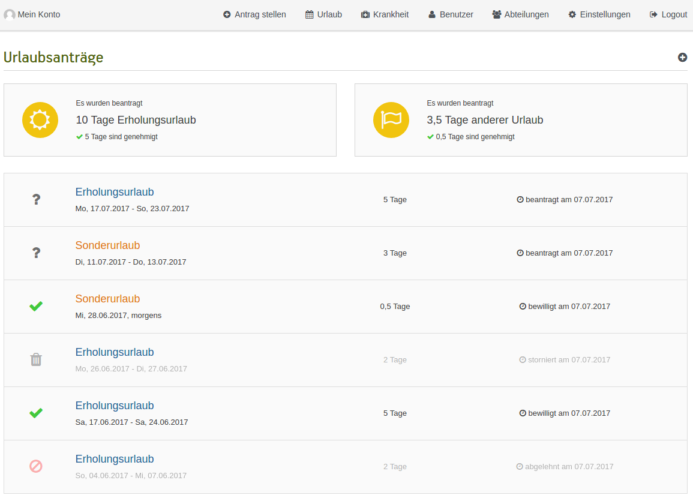

[](https://travis-ci.org/synyx/urlaubsverwaltung)
[](https://coveralls.io/github/synyx/urlaubsverwaltung?branch=master)

## Urlaubsverwaltung

* [Übersicht](#übersicht)
    * [Demo System](#demo-system)
    * [Blog Posts](#blog-posts)
    * [FAQ](#faq)
    * [Berechtigungen](#berechtigungen)
    * [REST-Schnittstelle](#rest-schnittstelle)
* [Installation](#installation)
* [Entwicklung](#entwicklung)
* [Changelog](CHANGELOG.md)
* [Technologien](#technologien)
* [Lizenz](#lizenz)

---

## Übersicht

Die Urlaubsverwaltung ist eine Web-Anwendung, die es ermöglicht, Urlaubsanträge von Mitarbeitern elektronisch zu
verwalten. Mitarbeiter stellen Urlaubsanträge, die von den jeweils Berechtigten genehmigt oder abgelehnt werden.
Die Anwendung bietet eine Übersicht über die bestehenden Urlaubsanträge und ermöglicht außerdem Überblick und Pflege
von Urlaubsanspruch und Anzahl verbleibender Urlaubstage der Mitarbeiter. Zusätzlich können Krankmeldungen erfasst und
überblickt werden.




#### Demo System

Zum Ausprobieren der Anwendung gibt es ein [Demo System](http://urlaubsverwaltung-demo.synyx.de) mit Testbenutzern für
die unterschiedlichen Rollen:

| Rolle                     | Benutzername  | Passwort | Vorname, Nachname |
| ------------------------- | ------------- | -------- | ----------------- |
| Office                    | test          | secret   | Marlene Muster    |
| Chef                      | testBoss      | secret   | Max Muster        |
| Freigabe Verantwortlicher | testManager   | secret   | Peter Huber       | 
| Abteilungsleiter          | testHead      | secret   | Thorsten Krüger   |
| Benutzer                  | testUser      | secret   | Klaus Müller      |

#### Blog Posts

Weitere Informationen zur Geschichte und Entwicklung der Urlaubsverwaltung findet man im
[synyx Blog](http://blog.synyx.de):

* [Stand November 2011](http://blog.synyx.de/2011/11/elektronische-urlaubsverwaltung-made-by-youngsters/)
* [Stand November 2012](http://blog.synyx.de/2012/11/urlaubsverwaltung-was-hat-sich-getan/)
* [Stand Oktober 2014](http://blog.synyx.de/2014/10/urlaubsverwaltung-goes-mobile/)

#### FAQ

Für Fragen, die bei der Benutzung der Urlaubsverwaltung aufkommen können, gibt es ein
[FAQ](https://github.com/synyx/urlaubsverwaltung/wiki).
Der Fragenkatalog erhebt keinen Anspruch auf Vollständigkeit und befindet sich im ständigen Wachstum und in Veränderung.

#### Berechtigungen

In der Urlaubsverwaltung gibt es aktuell folgende Arten von Berechtigungen:

* **inaktiv**: hat keinen Zugang mehr zur Urlaubsverwaltung (Daten des Benutzers bleiben zur Archivierung bestehen)
* **User**: darf Urlaub für sich selbst beantragen
* **Abteilungsleiter**: darf Urlaubsanträge für die Benutzer seiner Abteilungen einsehen, genehmigen und ablehnen
* **Freigabe Verantwortlicher**: ist bei der zweistufigen Genehmigung von Anträgen verantwortlich für die endgültige Freigabe
* **Chef**: darf Urlaubsanträge aller Benutzer einsehen, genehmigen und ablehnen
* **Office**: darf Einstellungen zur Anwendung vornehmen, Mitarbeiter verwalten, Urlaub für Mitarbeiter
beantragen/stornieren und Krankmeldungen pflegen

Eine aktive Person kann eine oder mehrere Rollen innehaben.

#### REST-Schnittstelle

Die Urlaubsverwaltung besitzt einen sich selbst beschreibende REST-Schnittstelle.
Diese kann mit über `/api/` aufgerufen werden, z.Bsp. hier: http://urlaubsverwaltung-demo.synyx.de/api/index.html

---

## Installation

Um eine aktuelle Version der Urlaubsverwaltung zu installieren, bitte die folgende Anleitung befolgen.

Falls noch eine ältere Version (< 2.12.0) der Urlaubsverwaltung verwendet hier, können Details zur Installation und
Konfiguration [hier](docs/INSTALLATION_AS_WAR.md) nachgelesen werden.

#### Systemvoraussetzungen

* JDK 8
* MySQL Datenbank

#### Download

Die Anwendung steht auf Github bereits als deploybare JAR-Datei zum Download zur Verfügung.
Einfach die JAR-Datei der aktuellsten Version [hier](https://github.com/synyx/urlaubsverwaltung/releases/latest)
downloaden.

#### Starten der Anwendung

Damit man die Anwendung möglichst schnell ausprobieren kann, bietet es sich an die Anwendung im Entwicklungsmodus
zu starten:

```bash
java -jar -Dspring.profiles.active=dev urlaubsverwaltung.jar
```

Auf diese Weise wird die Anwendung mit einer In-Memory-Datenbank und Testdaten gestartet.
Man kann sich mit den gleichen Benutzerdaten wie beim [Demo System](#demo-system) anmelden.

#### Aufrufen der Anwendung

Die Anwendung ist nun erreichbar unter

`<servername>:8080/`

#### Anwendung als Service

Da die Anwendung auf Spring Boot basiert, lässt sie sich sehr komfortabel als Service installieren. Wie genau dies
funktioniert, kann den entsprechenden Kapiteln in der Spring Boot Dokumentation nachgelesen werden:

* [Linux Service](http://docs.spring.io/spring-boot/docs/1.3.1.RELEASE/reference/html/deployment-install.html#deployment-service)
* [Windows Service](http://docs.spring.io/spring-boot/docs/1.3.1.RELEASE/reference/html/deployment-windows.html)

#### Konfigurationsdatei

Die Anwendung besitzt im Verzeichnis `src/main/resources` eine `application.properties` Datei zur Konfiguration.
Diese beinhaltet gewisse Grundeinstellungen und Standardwerte. Diese allein reichen für die Produktivnahme der
Anwendung allerdings noch nicht aus. Spezifische Konfigurationen wie z.B. die Datenbank Einstellungen müssen durch eine
eigene Properties-Datei hinterlegt werden. Welche Konfigurationen überschrieben werden können/müssen, kann in einer beispielhaften
[Konfigurationsdatei](https://raw.githubusercontent.com/synyx/urlaubsverwaltung/master/src/main/resources/example.properties)
eingesehen werden. Diese Datei kann einfach als Grundlage genommen werden, um eine eigene `application.properties` zu
erstellen, die die Standardwerte überschreibt.

Welche Möglichkeiten es bei Spring Boot gibt, damit die eigene Konfigurationsdatei genutzt wird, kann
[hier](http://docs.spring.io/spring-boot/docs/current/reference/html/boot-features-external-config.html#boot-features-external-config-application-property-files)
nachgelesen werden.

**Einfachste Möglichkeit**:
Man kann in dem Verzeichnis, in dem man die Anwendung startet eine Datei namens `application.properties` mit eigener
Konfiguration hinterlegen. Die dort konfigurierten Properties überschreiben dann die Standardwerte.

#### Datenbank

Die in der Konfigurationsdatei konfigurierte Datenbank muss existieren.

####  Achtung! Produktives Starten der Anwendung

Wenn eine eigene Konfigurationsdatei hinterlegt ist, darf die Anwendung natürlich **nicht** mehr im Entwicklungsmodus
gestartet werden, d.h. die Anwendung muss ohne `-Dspring.profiles.active=dev` gestartet werden:

```bash
java -jar urlaubsverwaltung.jar
```

#### Authentifizierung

Die Anwendung verfügt über **drei** verschiedene Authentifizierungsmöglichkeiten:

* `default`
    * für lokalen Entwicklungsmodus
* `ldap`
    * Authentifizierung via LDAP
    * Es müssen die LDAP URL, die LDAP Base und LDAP User DN Patterns konfiguriert sein, damit eine Authentifizierung via LDAP möglich ist.
* `activeDirectory`
    * Authentifizierung via Active Directory
    * Es müssen die Active Directory Domain und LDAP URL konfiguriert sein, damit eine Authentifizierung via Active Directory möglich ist.

Der erste Benutzer, der sich erfolgreich im System einloggt, wird in der Urlaubsverwaltung mit der Rolle Office angelegt.
Dies ermöglicht Benutzer- und Rechteverwaltung innerhalb der Anwendung und das Pflegen der Einstellungen für die Anwendung.

##### LDAP

Um LDAP zur Authentifizierung zu nutzen, muss die Property `auth` in der eigenen Konfigurationsdatei auf `ldap` gesetzt
werden:

<pre>auth=ldap</pre>

##### Active Directory

Um Active Directory zur Authentifizierung zu nutzen, muss die Property `auth` in der eigenen Konfigurationsdatei auf
`activeDirectory` gesetzt werden:

<pre>auth=activeDirectory</pre>

##### Synchronisation der User-Datenbank

Ab Version 2.14 werden die LDAP/AD-Benutzer nicht mehr automatisch in die Urlaubsverwaltung synchronisiert, sondern nur noch beim Login des jeweiligen Users in die Datenbank übertragen.
Man kann die automatische Synchronisation aller Benutzer aktivieren indem man in der Konfiguration das Property `uv.security.ldap.sync` bzw. `uv.security.activeDirectory.sync` auf `true` gesetzt wird:

<pre>uv.security.ldap.sync=true</pre> bzw. <pre>uv.security.activeDirectory.sync=true</pre>

---

## Entwicklung

Im Folgenden werden die durchzuführenden Schritte beschrieben, wenn man an der Urlaubsverwaltung entwickeln möchte.

#### Repository clonen

```bash
git clone git@github.com:synyx/urlaubsverwaltung.git
```

#### Anwendung starten

Die Urlaubsverwaltung ist eine [Spring Boot](http://projects.spring.io/spring-boot/) Anwendung und kann mit dem Maven
Plugin gestartet werden:

```bash
./mvnw clean spring-boot:run
```

bzw. für Windows Benutzer über:

```cmd
./mvnw.cmd clean spring-boot:run
```

<a name="mvn_profiles" />
Wenn mit einer eigenen Konfigurationsdatei gearbeitet werden soll, kann diese als Spring profile Parameter beim Start angegeben
werden. Zum Beispiel kann eine Konfiguration für MariaDB unter application-mariadb.properties angelegt und mit folgendem
Maven Aufruf gestartet werden:

```bash
./mvnw clean spring-boot:run -Drun.profiles=mariadb
```
Einzelne Parameter lassen sich mit `-D<parameterName>=<parameterWert>` überschreiben.

#### Anwendung nutzen
Im Browser lässt sich die Anwendung dann über `http://localhost:8080/` ansteuern.

Ohne weitere Anpassung der Standardkonfiguration wird eine H2-Datenbank verwendet und es werden Testdaten angelegt,
d.h. Benutzer, Urlaubsanträge und Krankmeldungen. Daher kann man sich in der Weboberfläche nun mit verschiedenen
Testbenutzern anmelden:

* `testUser/secret`: Benutzer mit der Rolle `User`
* `testBoss/secret`: Benutzer mit der Rolle `Boss`
* `testHead/secret`: Benutzer mit der Rolle `DepartmentHead`
* `testManager/secret`: Benutzer mit der Rolle `SecondStageAuthority`
* `test/secret`: Benutzer mit der Rolle `Office`

#### Anlegen von Testdaten deaktivieren

Möchte man, dass beim Starten der Anwendung keine Testdaten generiert werden, muss man die Property `testdata.create`
in den `application-dev.properties` auf `false` setzen.

#### H2 Web Konsole

Die Standardkonfiguration sorgt dafür, dass eine H2 Web Konsole aktiv ist. Diese kann standardmäßig erreicht werden
unter:

<pre>localhost:8080/h2-console/</pre>

Die H2 Konfigurationen können in der `application-dev.properties` überschrieben werden.

#### API

Die Urlaubsverwaltung verfügt über eine API, die unter `http://localhost:8080/api` erreichbar ist.

#### Authentifizierung

Siehe [Authentifizierung](#authentifizierung)

Möchte man LDAP oder Active Directory zur Authentifizierung nutzen, setzt man die Property `auth` entweder als System
Property oder man konfiguriert diese in den `application.properties` bzw. in den `application-dev.properties`.

Hinweis: Die Verbindung zum LDAP / Active Directory muss dafür selbstverständlich korrekt in den
`application.properties` bzw. in den `application-dev.properties` konfiguriert sein.

##### LDAP

Die Anwendung mit dem Parameter `-Dauth=ldap` starten:

```bash
./mvnw clean spring-boot:run -Dauth=ldap
```

Oder die Property `auth` in den `application.properties` bzw. in den `application-dev.properties` setzen:

<pre>auth=ldap</pre>

##### Active Directory

Die Anwendung mit dem Parameter `-Dauth=activeDirectory` starten:

```bash
./mvnw clean spring-boot:run -Dauth=activeDirectory
```

Oder die Property `auth` in den `application.properties` bzw. in den `application-dev.properties` setzen:

<pre>auth=activeDirectory</pre>

#### Externe Systeme mit Docker virtualisieren

Wenn man in einer produktions-nahen Umgebung entwickeln oder Probleme nachstellen will, bietet es sich an, die extenen
Systeme wie die Datenbank oder den LDAP-Server zu virtualisieren. [Hier wird gezeigt, wie man das mit Docker
tun kann.](docs/UV_WITH_DOCKER.md)

---

## Hinweise zu Versionen

Alle Änderungen an der Anwendung werden im Changelog gepflegt: [Changelog](CHANGELOG.md)

---

## Technologien

Die Anwendung basiert auf dem [Spring](http://www.springsource.org/) MVC Framework.
Zur Ermittlung von Feiertagen wird das Framework [Jollyday](http://jollyday.sourceforge.net/) benutzt.
Das Frontend beinhaltet Elemente von [Bootstrap](http://getbootstrap.com/) gewürzt mit einer Prise
[jQuery](http://jquery.com/) und [Font Awesome](http://fontawesome.io/).
Für die Darstellung der Benutzer Avatare wird [Gravatar](http://de.gravatar.com/) benutzt.
Zur Synchronisation der Urlaubs- und Krankmeldungstermine mit einem Microsoft Exchange Kalender wird die
[EWS JAVA API](https://github.com/OfficeDev/ews-java-api) genutzt.

## Lizenz

[synyx/urlaubsverwaltung](http://github.com/synyx/urlaubsverwaltung) is licensed under the
[Apache License 2.0](http://www.apache.org/licenses/LICENSE-2.0)

Alle Logos, Marken- und Warenzeichen unterliegen **nicht** der Apache License 2.0 und dürfen nur mit schriftlicher
Genehmigung von [synyx](http://www.synyx.de/) weiterverwendet werden.
