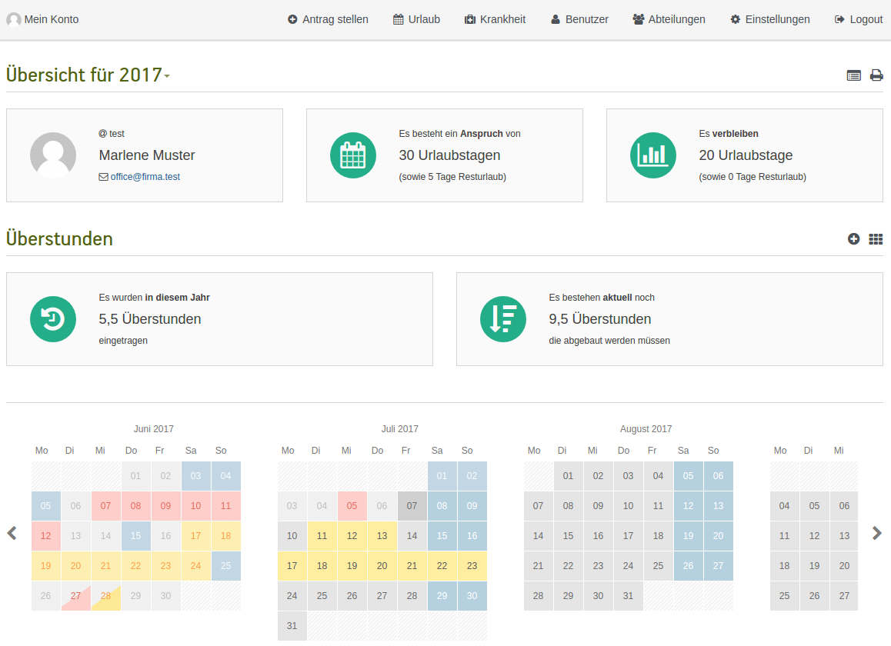
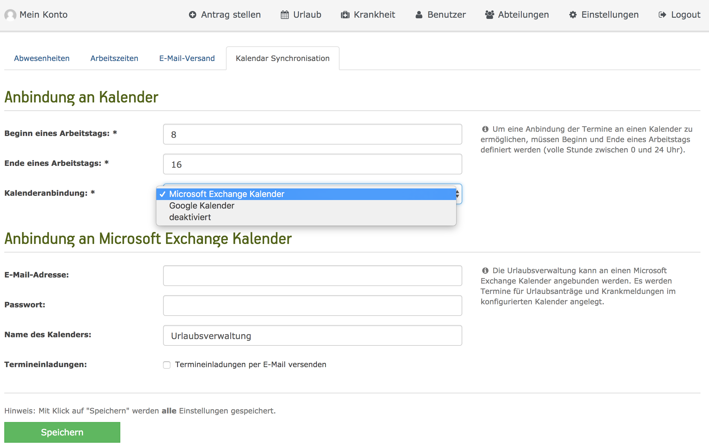
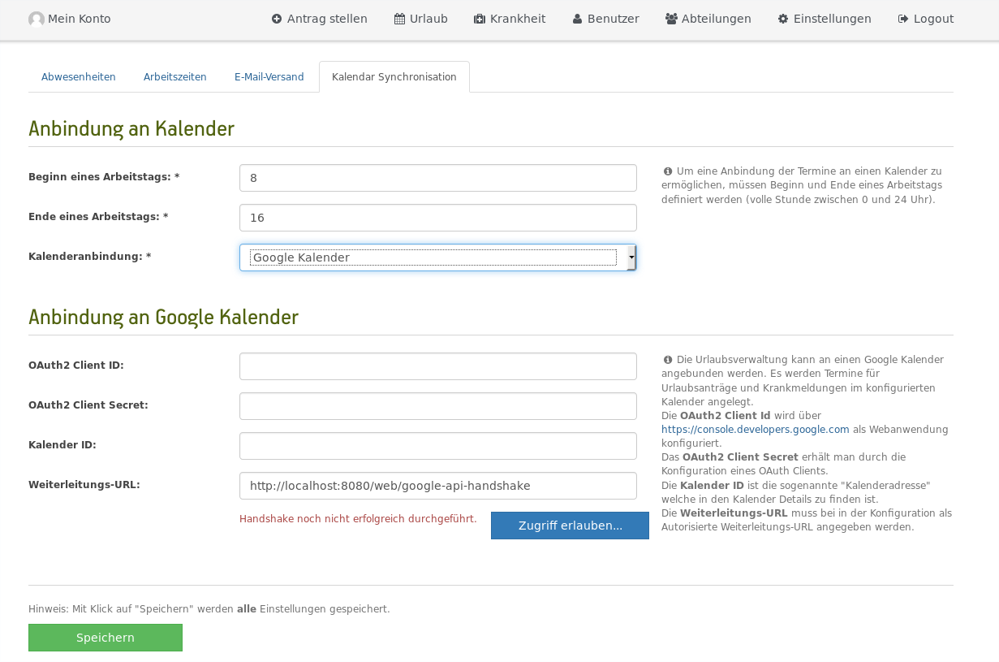
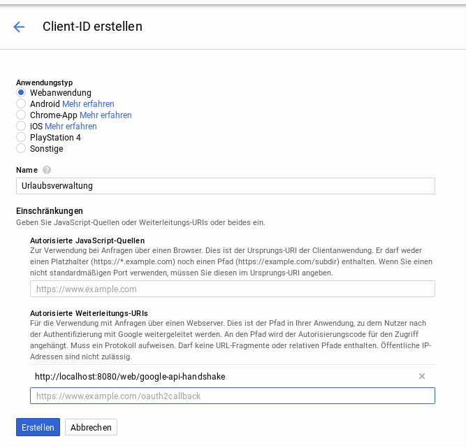

[](https://github.com/synyx/urlaubsverwaltung/actions?query=workflow%3A%22Urlaubsverwaltung+CI%22)
[](https://sonarcloud.io/dashboard?id=org.synyx:urlaubsverwaltung)
[](https://hub.docker.com/r/synyx/urlaubsverwaltung)
[](https://github.com/synyx/urlaubsverwaltung/releases/latest)

## Version 3.x

| Version 2.x wird nur noch bis zum **31.12.2019** mit Bug- und Sicherheitsupdates unterstützt.|
| --- |

Aufgrund von umfangreicheren Neuerungen haben wir
uns dafür entschieden, auf dem **master** Branch mit Version **3.x** durchzustarten.

**Version 2.x**

Du bist auf der Suche nach Version 2.x? Diese findest du [hier](https://github.com/synyx/urlaubsverwaltung/tree/v2.x).

Du möchtest wissen, was alles zu tun ist, um von 2.x auf 3.x umzusteigen?
Dann wirf einen Blick in den [Migration Guide](https://github.com/synyx/urlaubsverwaltung/wiki/Urlaubsverwaltung-3.0-Migration-Guide).

Bitte beachte, dass die Version 2.x nur noch bis zum **31.12.2019** mit Bug- und Sicherheitsupdates unterstützt wird.
Danach wird ausschließlich an 3.x weiterentwickelt werden.

# Urlaubsverwaltung
                             
 * [Übersicht](#übersicht)
   * [Demo System](#demo-system)
 * [FAQ](#faq)
 * [Changelog](CHANGELOG.md) 
 * [Berechtigungen](#berechtigungen)
 * [REST-Schnittstelle](#rest-schnittstelle)
 * [Installation](#installation)
   * [Systemvoraussetzungen](#systemvoraussetzungen)
   * [Download](#download)
 * [Betrieb](#betrieb)
   * [Konfiguration](#konfiguration)
   * [Testbetrieb](#testbetrieb)
     * [Starten der Anwendung](#starten-der-anwendung)
     * [Aufrufen der Anwendung](#aufrufen-der-anwendung)
   * [Produktivbetrieb](#produktivbetrieb)
     * [Anwendung als Service](#anwendung-als-service)
     * [Konfiguration](#konfiguration)
     * [Datenbank](#datenbank)
     * [Starten der Anwendung](#starten-der-anwendung)
     * [Authentifizierung](#authentifizierung)
     * [Synchronisation der User-Datenbank](#synchronisation-der-user-datenbank)
     * [Synchronisation mit Kalender](#synchronisation-mit-kalender)
      * [Konfiguration Microsoft Exchange](#konfiguration-microsoft-exchange)
      * [Konfiguration Google Calendar](#konfiguration-google-calendar)
 * [Entwicklung](#entwicklung)
 * [Technologien](#technologien)
 * [Lizenz](#lizenz)

---

## Übersicht

Die Urlaubsverwaltung ist eine Web-Anwendung, um Urlaubsanträge elektronisch
verwalten zu können.

Mitarbeiter stellen Urlaubsanträge, die von den jeweils Berechtigten genehmigt oder abgelehnt werden können.
Die Anwendung bietet einen komfortablen Überblick über offene Urlaubsanträge und
den (verbleibenden) Urlaubsanspruch von Mitarbeitern.

Außerdem können auch Krankmeldungen und Überstunden erfasst und überblickt werden.



### Demo System

Zum Ausprobieren der Anwendung gibt es ein [Demo System mit dem 'Office' Benutzer](https://urlaubsverwaltung-demo.synyx.de/login?username=office&password=secret)
zum Testen. Die Rollen findest du im Abschnitt [Testbenutzer](#testbenutzer).

### Geschichte

Weitere Informationen zur Geschichte und Entwicklung der Urlaubsverwaltung findest du im
[synyx Blog](https://www.synyx.de/blog/):

* [Stand November 2011](https://www.synyx.de/blog/elektronische-urlaubsverwaltung-made-by-youngsters/)
* [Stand November 2012](https://www.synyx.de/blog/urlaubsverwaltung-was-hat-sich-getan/)
* [Stand Oktober 2014](https://www.synyx.de/blog/urlaubsverwaltung-goes-mobile/)
* [Stand April 2017](https://synyx.de/blog/urlaubsverwaltung-die-geschichte-eines-open-source-projekts/)

---

## FAQ

Für Fragen, die bei der Benutzung der Urlaubsverwaltung aufkommen, gibt es ein
[FAQ](https://github.com/synyx/urlaubsverwaltung/wiki/FAQ).
Sollte dieser Fragenkatalog nicht weiterhelfen, kannst du gerne [ein neues Issue](https://github.com/synyx/urlaubsverwaltung/issues/new/choose)
vom Typ "Question" erstellen.

## Changelog

Alle Änderungen an der Anwendung werden im [Changelog](CHANGELOG.md) gepflegt.

## Berechtigungen

In der Urlaubsverwaltung gibt es aktuell folgende Arten von Berechtigungen:

* **inaktiv**: hat keinen Zugang mehr zur Urlaubsverwaltung (Daten des Benutzers bleiben zur Archivierung bestehen)
* **User**: darf Urlaub für sich selbst beantragen
* **Abteilungsleiter**: darf Urlaubsanträge für die Benutzer seiner Abteilungen einsehen, genehmigen und ablehnen
* **Freigabe-Verantwortlicher**: ist bei der zweistufigen Genehmigung von Anträgen verantwortlich für die endgültige Freigabe
* **Chef**: darf Urlaubsanträge aller Benutzer einsehen, genehmigen und ablehnen
* **Office**: darf Einstellungen zur Anwendung vornehmen, Mitarbeiter verwalten, Urlaub für Mitarbeiter
beantragen/stornieren und Krankmeldungen pflegen
* **Admin**: Keine fachliche Rolle sondern nur für den Zugriff von Management Schnittstellen ([Spring Boot Actuator](https://docs.spring.io/spring-boot/docs/current/reference/html/production-ready-endpoints.html)).

Eine aktive Person kann eine oder mehrere Rollen innehaben.

## REST-Schnittstelle

Die Urlaubsverwaltung besitzt eine sich selbst beschreibende REST-Schnittstelle.
Diese kann über `/api/` aufgerufen werden.

---

## Installation

Um eine aktuelle Version der Urlaubsverwaltung zu installieren, bitte die folgende Anleitung befolgen.

Zusätzlich wird die Urlaubsverwaltung auch als Docker Image [synyx/urlaubsverwaltung](https://hub.docker.com/r/synyx/urlaubsverwaltung) bereitgestellt.
Beispiele zu diesem Deployment gibt es [hier](.examples/README.md).

### Systemvoraussetzungen

* JDK 11
* MariaDB Datenbank (v10.4)
* Docker 17.12.0+ & Docker Compose

### Download

Die Anwendung steht auf Github als deploybare WAR-Datei zum Download zur Verfügung.
Einfach die WAR-Datei der aktuellsten Version [hier](https://github.com/synyx/urlaubsverwaltung/releases/latest)
downloaden. Auch wenn der Download eine WAR-Datei ist, kann sie wie die bisherige JAR-Datei verwendet werden,
da die WAR-Datei einen Tomcat bundled.

### Vorbereitung

* Legen Sie in der MariaDB/MySQL-Datenbank eine Datenbank `urlaubsverwaltung` an und einen Benutzer `urlaubsverwaltung` mit Zugriffsrechten für diese Datenbank. Stellen Sie sicher, dass MariaDB/MySQL die Systemvoraussetzungen erfüllt.
* Legen Sie ein Verzeichnis für die Urlaubsverwaltung an (z.B. `/opt/urlaubsverwaltung`). Kopieren Sie die WAR-Datei (s. Download) dorthin.
* Erstellen Sie in dem Verzeichnis eine Datei `application.properties`, welche die Konfiguration für die Urlaubsverwaltung erlaubt. Die vollständigen Konfigurationsoptionen für `application.properties` finden Sie im Repository: [application.properties](src/main/resources/application.properties)
* Tragen Sie in der Konfigurationsdatei zunächst die Zugangsdaten für die Datenbank ein:

```
# DATABASE -------------------------------------------------------------------------------------------------------------
spring.datasource.url=jdbc:mariadb://localhost:3306/urlaubsverwaltung
spring.datasource.username=urlaubsverwaltung
spring.datasource.password=PASSWORT
```

* Wenn Sie die Urlaubsverwaltung das erste Mal starten, werden automatisch alle Datenbank-Tabellen konfiguriert. Sie können die WAR-Datei direkt wie folgt starten:

```
java -jar Urlaubsverwaltung.WAR
``` 

* Wenn die Initialisierung abgeschlossen ist, kann die Oberfläche auf Port 8080 im Browser aufgerufen werden: https://127.0.0.1:8080
* Damit der Login funktioniert, ist eine Anbindung an Active Directory oder LDAP erforderlich. Diese wird weiter unten beschrieben.
* Sollten beim Starten oder bei der Konfiguration Probleme auftreten, lässt sich in der Konfigurationsdatei eine ausführliche Debug-Ausgabe konfigurieren:

```
# LOGGING --------------------------------------------------------------------------------------------------------------
logging.level.org.synyx.urlaubsverwaltung=TRACE
logging.level.org.springframework.security=TRACE
logging.file=logs/urlaubsverwaltung.log
```

* Das Programm wird in dem Arbeitsverzeichnis ein Verzeichnis `logs` mit Logfiles anlegen.

## Betrieb

### Konfiguration

Die Anwendung besitzt im Verzeichnis `src/main/resources` eine `application.properties` Datei zur Konfiguration.
Diese beinhaltet gewisse Grundeinstellungen und Standardwerte. Diese allein reichen für die Produktivnahme der
Anwendung allerdings noch nicht aus. Spezifische Konfigurationen wie z.B. die Datenbank Einstellungen müssen durch eine
eigene Properties-Datei hinterlegt werden.

**Einfachste Möglichkeit**:
Man kann in dem Verzeichnis, in dem man die Anwendung startet eine Datei namens `application.properties` mit eigener
Konfiguration hinterlegen. Die dort konfigurierten Properties überschreiben dann die Standardwerte.

Welche Möglichkeiten es bei Spring Boot gibt, damit die eigene Konfigurationsdatei genutzt wird, kann
[hier](http://docs.spring.io/spring-boot/docs/current/reference/html/boot-features-external-config.html#boot-features-external-config-application-property-files)
nachgelesen werden.

Nachstehend alle spezifischen Konfigurationsmöglichkeiten der Urlaubsverwaltung mit ihren Standartwerten.

```
# account
uv.account.default-vacation-days = 20
# (on 1st January at 05:00 am)
uv.account.update.cron = 0 0 5 1 1 *

# application
# (every day at 07:00 am)
uv.application.reminder-notification.cron = 0 0 7 * * *

# development
uv.development.testdata.create

# mail
uv.mail.administrator
uv.mail.application-url
uv.mail.sender

# security
uv.security.auth =  default

uv.security.directory-service.identifier
uv.security.directory-service.last-name
uv.security.directory-service.first-name
uv.security.directory-service.mail-address
uv.security.directory-service.sync.cron = 0 0 1 * * ? (every night at 01:00 am)
uv.security.directory-service.filter.member-of
uv.security.directory-service.filter.object-class = person

## active directory
uv.security.directory-service.active-directory.url = ldap://ad.example.org/
uv.security.directory-service.active-directory.domain = example.org
uv.security.directory-service.active-directory.sync.enabled = false
uv.security.directory-service.active-directory.sync.password = password
uv.security.directory-service.active-directory.sync.user-dn = cn=Administrator,cn=users,dc=example,dc=org
uv.security.directory-service.active-directory.sync.user-search-base = dc=example,dc=org

## ldap
uv.security.directory-service.ldap.url = ldap://ldap.example.org/
uv.security.directory-service.ldap.base = dc=example,dc=org
uv.security.directory-service.ldap.manager-dn
uv.security.directory-service.ldap.manager-password
uv.security.directory-service.ldap.user-search-filter = (uid={0})
uv.security.directory-service.ldap.user-search-base = ou=accounts
uv.security.directory-service.ldap.sync.enabled = false
uv.security.directory-service.ldap.sync.password = password
uv.security.directory-service.ldap.sync.user-dn = uid=username,ou=other,ou=accounts,dc=example,dc=org
uv.security.directory-service.ldap.sync.user-search-base = ou=people,ou=accounts

# oidc (openid connect)
uv.security.oidc.client-id
uv.security.oidc.client-secret
uv.security.oidc.issuer-uri
uv.security.oidc.logout-path

# person
uv.person.can-be-manipulated = false

# sick-note
# (every day at 06:00 am)
uv.sick-note.end-of-pay-notification.cron = 0 0 6 * * *

# workingtime
# (monday till friday)
uv.workingtime.default-working-days[0] = 1
uv.workingtime.default-working-days[1] = 2
uv.workingtime.default-working-days[2] = 3
uv.workingtime.default-working-days[3] = 4
uv.workingtime.default-working-days[4] = 5
```


### Testbetrieb

#### Starten der Anwendung

Um die Anwendung möglichst schnell ausprobieren zu können, bietet es sich an die Datenbank via [Docker Compose](https://docs.docker.com/compose/overview/)
zu starten:

```bash
docker-compose up
```

und die Anwendung mit dem Profil `testdata` zu starten:

```bash
java -jar -Dspring.profiles.active=testdata urlaubsverwaltung.war
```

Auf diese Weise wird die Anwendung mit einer MariaDB-Datenbank gestartet und Testdaten generiert.
Die Testdaten enthalten folgende Nutzer:

#### Testbenutzer

| Rolle                            | Benutzername           | Passwort |
| -------------------------        | -------------          | -------- |
| User                             | user                   | secret   |
| User & Abteilungsleiter          | departmentHead         | secret   |
| User & Freigabe-Verantwortlicher | secondStageAuthority   | secret   |
| User & Chef                      | boss                   | secret   |
| User & Chef & Office             | office                 | secret   |
| User & Admin                     | admin                  | secret   |

#### Aufrufen der Anwendung

Folgende systeme sind erreichbar

| Service                   | Port    |
| ------------------------- | ------- |
| Urlaubsverwaltung         | 8080    |
| Mailhog                   | 8025    |
| Mailhog SMTP              | 1025    |


### Produktivbetrieb

#### Anwendung als Service

Da die Anwendung auf Spring Boot basiert, lässt sie sich sehr komfortabel als Service installieren. Wie genau dies
funktioniert, kann den entsprechenden Kapiteln der Spring Boot Dokumentation entnommen werden:

* [Linux Service](http://docs.spring.io/spring-boot/docs/current/reference/html/deployment-install.html#deployment-service)
* [Windows Service](http://docs.spring.io/spring-boot/docs/current/reference/html/deployment-windows.html)

#### Datenbank

Die in der Konfigurationsdatei konfigurierte Datenbank muss existieren.

####  Starten der Anwendung

Im Produktivbetrieb mit der Produktivdatenbank darf die Anwendung natürlich **nicht** mehr mit Testdaten
gestartet werden, d.h. die Anwendung muss ohne `-Dspring.profiles.active=testdata` gestartet werden:

```bash
java -jar urlaubsverwaltung.war
```

#### Authentifizierung

Die Anwendung verfügt über **vier** verschiedene Authentifizierungsmöglichkeiten:

* `default`
    * für lokalen Entwicklungsmodus
* `ldap`
    * Authentifizierung via LDAP
    * Es müssen die LDAP URL, die LDAP Base und LDAP User DN Patterns
      konfiguriert sein, damit eine Authentifizierung via LDAP möglich ist.
* `activedirectory`
    * Authentifizierung via Active Directory
    * Es müssen die Active Directory Domain und LDAP URL konfiguriert
      sein, damit eine Authentifizierung via Active Directory möglich ist.
* `oidc`
    * Authentifizierung via OpenID Connect (OIDC)
    * Es müssen die OIDC issuerUri sowie die client id/secret definiert werden.
      Ausserdem müssen bei dem gewählten OIDC Provider die 'Allowed Logout URLs',
      die 'Allowed Callback URLs' und ggfs weitere Einstellungen vorgenommen werden.

Der erste Benutzer, der sich erfolgreich im System einloggt, wird in der Urlaubsverwaltung mit der Rolle Office angelegt.
Dies ermöglicht Benutzer- und Rechteverwaltung innerhalb der Anwendung und das Pflegen der Einstellungen für die Anwendung.

Der Authentifizierungsmodus muss über die Property `uv.security.auth` in der eigenen Konfigurationsdatei gesetzt werden:

<pre>uv.security.auth=ldap</pre>

bzw.

<pre>uv.security.auth=activedirectory</pre>

#### Synchronisation der User-Datenbank

Ab Version 2.14 werden die LDAP/AD-Benutzer nicht mehr automatisch in die Urlaubsverwaltung synchronisiert, sondern nur noch beim Login des jeweiligen Users in die Datenbank übertragen.
Man kann die automatische Synchronisation aller Benutzer aktivieren indem man in der Konfiguration das Property `uv.security.directory-service.ldap.sync.enabled` bzw. `uv.security.directory-service.active-directory.sync.enabled` auf `true` gesetzt wird:

<pre>uv.security.directory-service.ldap.sync.enabled=true</pre> bzw. <pre>uv.security.directory-service.active-directory.sync.enabled=true</pre>

#### Synchronisation mit Kalender

Die Urlaubsverwaltung bietet die Möglichkeit alle Urlaube und Krankheitstage mit einem Kalender zu synchronisieren. Dafür werden Microsoft Exchange bzw. Office 356 und Google Calendar unterstützt.

##### Konfiguration Microsoft Exchange



Anhand der zu konfigurierenden E-Mail-Adresse wird per Autodiscovery die dazugehörige Exchange Server Adresse ermittelt,
welche für die Synchronisation verwendet wird. Wichtig ist, dass der gewünschte Kalender bereits zuvor angelegt wurde.

##### Konfiguration Google Calendar


Die Anbindung von Google Calendar basiert auf einem OAuth 2.0 Handshake.
Sobald alle Konfigurationsfelder wie unten beschrieben für die Synchronisation mit Google Calendar befüllt sind, kann mit dem Button "Zugriff erlauben..." der OAuth 2.0 Handshake durchgeführt werden. Sofern dieser Schritt erfolgreich war und die Synchronisation eingerichtet ist, steht neben dem Button "Verbindung zum Google-Kalender ist hergestellt."

###### Client anlegen



Um einen solchen OAuth 2.0 Handshake durchführen zu können, ist es zunächst notwendig die Urlaubsverwaltung als Anwendung bei Google bekannt zu machen.
Dies geschieht über [APIs und Services](https://console.developers.google.com). Hier muss zunächst ein [Projekt angelegt](https://console.developers.google.com/projectcreate) werden. Sobald das geschehen ist, kann die [Calendar API](https://console.developers.google.com/apis/library/calendar-json.googleapis.com/) aktiviert werden. Nach der Aktivierung müssen außerdem [OAuth 2.0 Client Zugangsdaten](https://console.developers.google.com/apis/credentials/oauthclient) erzeugt werden. Es müssen außerdem die autorisierte Weiterleitungs-URIs mit dem Wert gefüllt werden, der in den Einstellungen unter Weiterleitungs-URL angezeigt wird. Direkt nach der Erstellung werden **Client Id** und **Client Secret** angezeigt. Diese müssen dann in den Einstellungen der Urlaubsverwaltung entsprechend hinterlegt werden.

###### Kalender anlegen/konfigurieren

Eine weitere notwendige Information ist die **Kalender ID**, welche später zur Synchronisation verwendet wird. Es kann dafür entweder ein bestehender Kalender verwendet oder ein [neuer Kalender angelegt](https://calendar.google.com/calendar/r/settings/createcalendar) werden. In Google Calendar kann man dann in den Kalendereinstellungen die **Kalendar ID** finden. Diese muss ebenfalls in der Urlaubsverwaltung gepflegt werden.

###### Urlaubsverwaltung Weiterleitungs-URL

Damit der OAuth 2.0 Handshake durchgeführt werden kann, ist es notwendig die Weiterleitungs-URL bei der Konfiguration der Webanwendung bei Google anzugeben. Diese ist abhängig von der Installation und wird in den Einstellungen des Google Kalenders angezeigt, z.B. `http://localhost:8080/web/google-api-handshake` für ein Testsystem. Sie ist nur für die initiale Freigabe des Kalenders nötig.

---

## Entwicklung

Im Folgenden werden die durchzuführenden Schritte beschrieben, wenn man an der Urlaubsverwaltung entwickeln möchte.

### Repository clonen

```bash
git clone git@github.com:synyx/urlaubsverwaltung.git
```

### Release

Für ein Release wird das [maven-release-plugin](http://maven.apache.org/maven-release/maven-release-plugin/) verwendet. 
Zum sorgenfreien Erstellen eines Release kann folgendes Skript verwendet werden.

```bash
export RELEASE_VERSION=0.10.0
export NEW_VERSION=0.11.0-SNAPSHOT
./release.sh
git fetch
```

### Anwendung starten

Da die Urlaubsverwaltung abhängig von einer MariaDB-Datenbank ist, kann diese über

```bash
docker-compose up
```
gestartet werden. ([Wie installiere ich Docker Compose?](https://docs.docker.com/compose/install/))

Die Urlaubsverwaltung ist eine [Spring Boot](http://projects.spring.io/spring-boot/) Anwendung und kann mit dem Maven
Plugin gestartet werden. Es bietet sich an, die Anwendung mit dem Profil `testdata` zu starten, um Testdaten generieren
zu lassen:

```bash
./mvnw clean spring-boot:run -Dspring-boot.run.profiles=testdata
```

bzw. für Windows Benutzer über:

```bash
./mvnw.cmd clean spring-boot:run -Dspring-boot.run.profiles=testdata
```

Hinweis: Aufgrund der Spring Boot Dev Tools wird das Profil via `spring-boot.run.profiles` gesetzt, statt via
`spring.profiles.active`. (vgl. https://github.com/spring-projects/spring-boot/issues/10926)

### Anwendung nutzen

Im Browser lässt sich die Anwendung dann über `http://localhost:8080/` ansteuern.

Mit dem `testdata` Profil wird eine MariaDB-Datenbank verwendet und es werden Testdaten angelegt,
d.h. Benutzer, Urlaubsanträge und Krankmeldungen. Daher kann man sich in der Weboberfläche nun mit verschiedenen
[Testbenutzern](#testbenutzer) anmelden.

### Frontend Entwicklung

Die User Experience einiger Seiten wird zur Laufzeit mit JavaScript weiter verbessert.

Assets sind in `<root>/src/main/webapp` zu finden

* `bundles` sind in den JSPs zu integrieren
* `components` sind einzelne Komponenten zur Wiederverwendung wie z. B. der _datepicker_
* `js` beinhaltet seitenspezifische Dinge
* `lib` sind third-party Bibliotheken

Der Frontend Build ist in Maven integriert. Isoliert können die Assets aber auch auf der Kommandozeile gebaut werden.

* `npm run build`
  * baut optimierte, minifizierte Assets
  * Info: der Dateiname beinhaltet einen Hash welcher eindeutig zum Inhalt des Assets passt 
* `npm run build:dev`
  * baut nicht minifizierte Assets
* `npm run build:watch`
  * baut automatisch nach dem Editieren von JavaScript / CSS Dateien neue Assets

#### Long term caching von Assets

Startet man den Maven Build oder baut man die Assets mit dem NPM Task `npm run build` wird eine JSON Datei `asstes-mannifest.json` angelegt.
Das Manifest beschreibt ein Mapping der bundles zum generierten Dateinamen inklusive Hash. Dieser gemappte Dateiname muss
in den JSPs integriert werden. Damit das nicht bei jeder Änderung manuell gemacht werden muss, kann der Dateiname mit Hilfe der
Taglib `AssetsHashResolverTag.java` zur Kompilierungszeit der JSP automatisiert werden.

```jsp
<%@taglib prefix="asset" uri = "/WEB-INF/asset.tld"%>

<script defer src="<asset:url value='npm.jquery.js' />"></script>
```

### Anlegen von Testdaten deaktivieren

Möchte man, dass beim Starten der Anwendung keine Testdaten generiert werden, muss man die Property `uv.development.testdata.create`
in den `application-testdata.properties` auf `false` setzen.

### API

Die Urlaubsverwaltung verfügt über eine API, die unter `http://localhost:8080/api` erreichbar ist.

### Authentifizierung

Siehe [Authentifizierung](#authentifizierung)

Die Anwendung mit **OpenID Connect (OIDC)** starten:

```bash
./mvnw clean spring-boot:run -Duv.security.auth=oidc
```

Oder in den `application.properties` konfigurieren:

<pre>uv.security.auth=oidc</pre>


Die Anwendung mit **LDAP** starten:

```bash
./mvnw clean spring-boot:run -Duv.security.auth=ldap
```

Oder in den `application.properties` konfigurieren:

<pre>uv.security.auth=ldap</pre>


Die Anwendung mit **Active Directory (AD)** starten:

```bash
./mvnw clean spring-boot:run -Duv.security.auth=activedirectory
```

Oder in den `application.properties` konfigurieren:

<pre>uv.security.auth=activedirectory</pre>


### Externe Systeme mit Docker virtualisieren

Wenn man in einer produktions-nahen Umgebung entwickeln oder Probleme nachstellen will, bietet es sich an, die externen
Systeme wie die Datenbank oder den LDAP-Server zu virtualisieren. [Hier wird gezeigt, wie man das mit Docker
tun kann.](docs/UV_WITH_DOCKER.md)

---

## Technologien

* Die Anwendung basiert auf dem [Spring](https://spring.io/projects/spring-boot) Boot Framework.
* Zur Ermittlung von Feiertagen wird das Framework [Jollyday](http://jollyday.sourceforge.net/) benutzt.
* Das Frontend beinhaltet Elemente von [Bootstrap](http://getbootstrap.com/) gewürzt mit einer Prise
[jQuery](http://jquery.com/) und [Font Awesome](http://fontawesome.io/).
* Für die Darstellung der Benutzer Avatare wird [Gravatar](http://de.gravatar.com/) benutzt.
* Zur Synchronisation der Urlaubs- und Krankmeldungstermine mit einem Microsoft Exchange Kalender wird die
[EWS JAVA API](https://github.com/OfficeDev/ews-java-api) genutzt.
* Zur Synchronisation der Urlaubs- und Krankmeldungstermine mit einem Google Calendar wird der
[Google API Client](https://github.com/google/google-api-java-client) verwendet.
* Zur Synchronisation mit Exchange wird die [EWS Java API](https://github.com/OfficeDev/ews-java-api) verwendet
* Initialisierung und Migration der Datenbank wird mit [Liquibase](https://www.liquibase.org/) durchgeführt

---

## Lizenz

[synyx/urlaubsverwaltung](http://github.com/synyx/urlaubsverwaltung) is licensed under the
[Apache License 2.0](LICENSE.txt)
