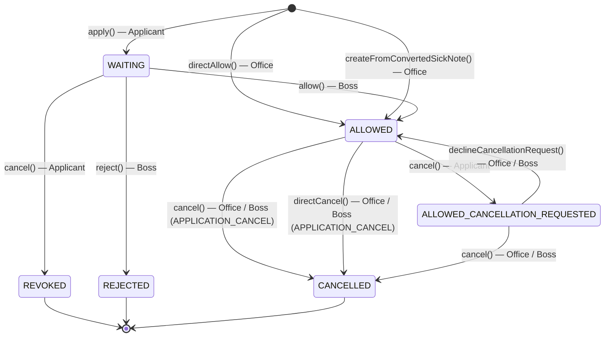
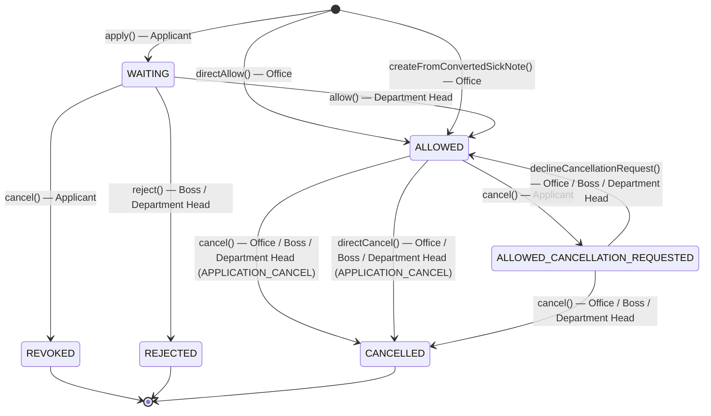
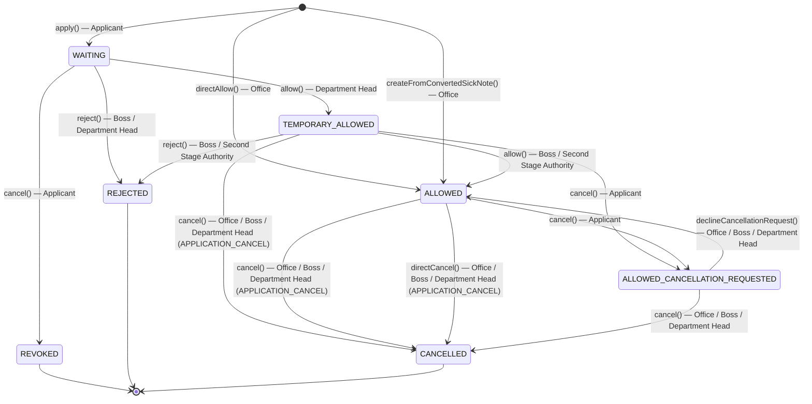

# Application for Leave — Workflow

## 1. Without Departments/Department Heads

## 2. Departments with Department Heads (single-stage authorization)

## 3. Departments with Department Head and Second Stage Authority (two-stage authorization)

## States

| Status                           | Description                                                               |
|----------------------------------|---------------------------------------------------------------------------|
| `WAITING`                        | Application submitted, waiting for approval                               |
| `TEMPORARY_ALLOWED`              | Provisionally approved by department head in a two-stage approval process |
| `ALLOWED`                        | Fully approved                                                            |
| `ALLOWED_CANCELLATION_REQUESTED` | Approved, but applicant has requested cancellation                        |
| `REVOKED`                        | Withdrawn by applicant before approval                                    |
| `REJECTED`                       | Rejected by management                                                    |
| `CANCELLED`                      | Cancelled after approval                                                  |

## Notes

- **Boss** and **Office** are distinct roles: Boss approves and rejects; Office handles administrative actions (direct cancellation, declining cancellation requests) and can always do so without additional permissions.
- **APPLICATION_CANCEL** is an additional permission required for Boss or Department Head to cancel directly. Office can always cancel directly.
- **Side operations without status change**: `edit()` (Applicant / Office), `refer()` (Boss / Office), `remind()` (Applicant).
