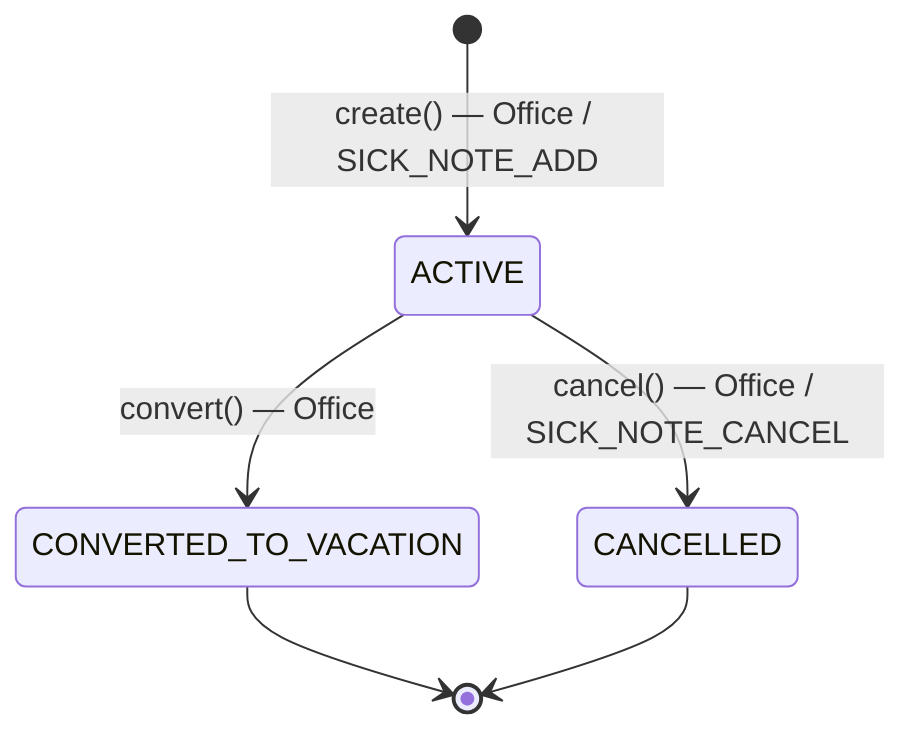
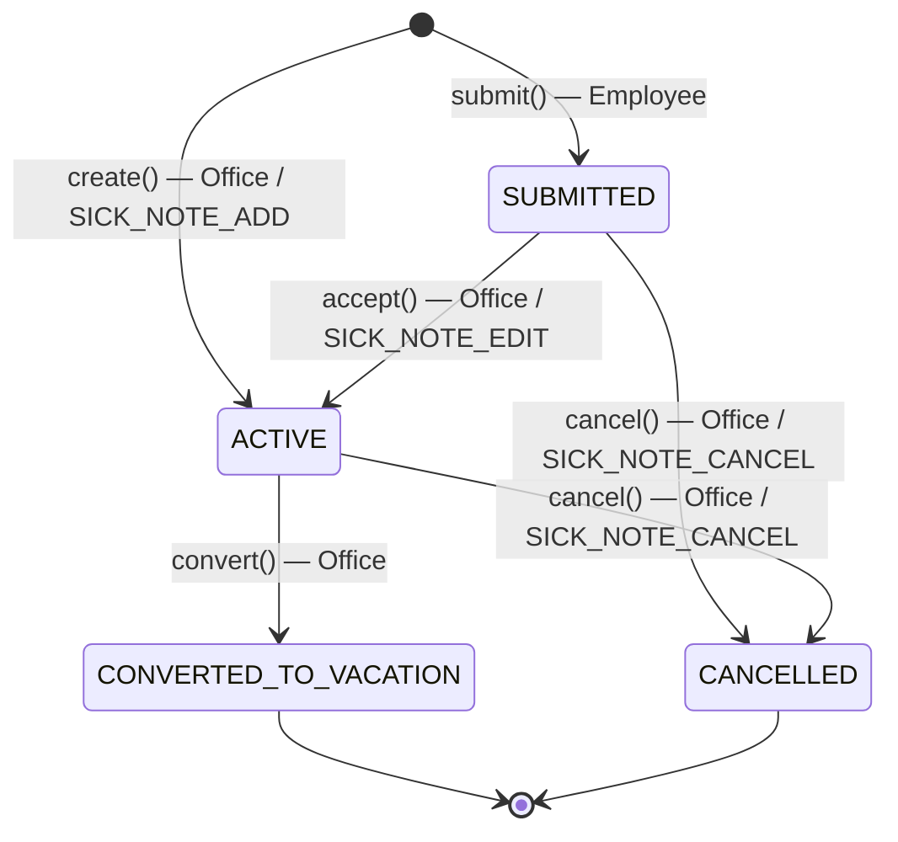
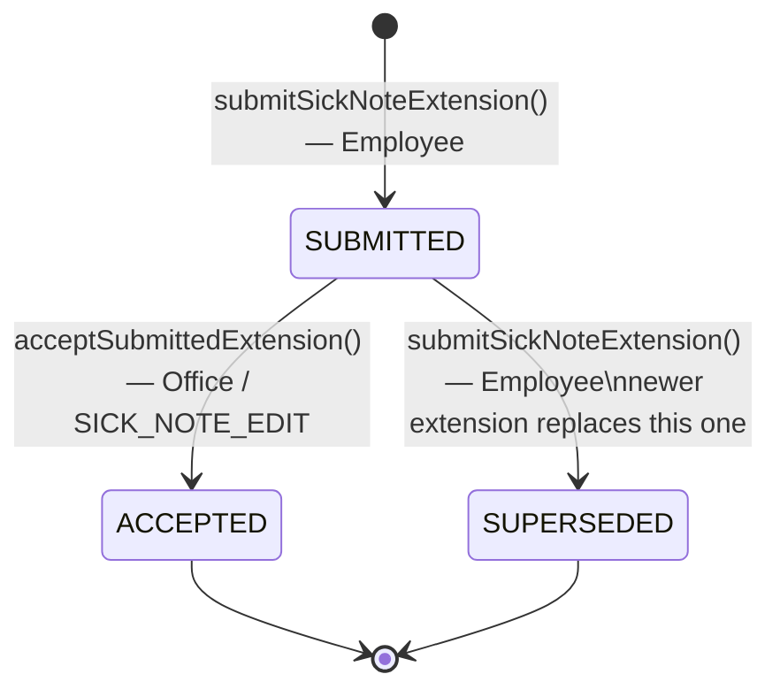

# Sick Note — Workflow

## 1. Without Sick Note Submission

Office or privileged management creates the sick note directly as active.

## 2. With Sick Note Submission

Employees submit their own sick note; Office or privileged management then accepts or cancels it.

## 3. Sick Note Extension

Extends the end date of an `ACTIVE` sick note. The extension has its own lifecycle; the sick note itself stays `ACTIVE` throughout.

> **Note:** If the sick note itself is still `SUBMITTED` (not yet accepted), the employee can update the end date directly via `update()` without creating an extension request.

## States

### Sick Note

| Status                 | Description                                              |
|------------------------|----------------------------------------------------------|
| `SUBMITTED`            | Submitted by employee, waiting for acceptance            |
| `ACTIVE`               | Created or accepted; used in absence calculations        |
| `CONVERTED_TO_VACATION`| Converted to an application for leave                    |
| `CANCELLED`            | Cancelled                                                |

### Sick Note Extension

| Status      | Description                                                         |
|-------------|---------------------------------------------------------------------|
| `SUBMITTED` | Extension submitted by employee, waiting for acceptance             |
| `ACCEPTED`  | Extension accepted; sick note end date updated                      |
| `SUPERSEDED`| Replaced by a newer extension or the sick note was converted        |

## Notes

- **Side operations without status change**: `update()` (Office / SICK_NOTE_EDIT, or Employee if sick note is `SUBMITTED`).
- **convert()** triggers `createFromConvertedSickNote()` on the application side, creating a directly `ALLOWED` application for leave.
- **SICK_NOTE_ADD**, **SICK_NOTE_EDIT**, and **SICK_NOTE_CANCEL** are additional permissions that Boss, Department Head, or Second Stage Authority must hold to perform these actions. Office can always act without them.